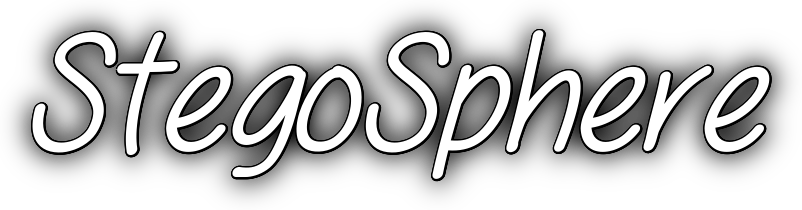

<p align="center">
	
</p>

<p align="center">
	
	
	
</p>

## What is StegoSphere?

StegoSphere is a desktop steganography app for hiding encrypted text inside
images. It combines LSB image encoding, password-based encryption, and an
optional email workflow into a single local-first tool.

The goal is simple: give you a polished, open-source way to prepare and recover
hidden messages without relying on web services or external infrastructure.

## Highlights

* Hide text inside images using least-significant-bit (LSB) steganography.
* Encrypt hidden content before embedding it into the image.
* Recover hidden messages with the original password.
* Send generated steganographic images by email when configured.
* Use a PyQt6 interface designed for a straightforward desktop workflow.

## Screenshots

Screenshots are not bundled yet. If you want this README to feel even more like a
large open-source project, add a few app screenshots or a short demo GIF to the
`assets/` directory and link them here.

## How It Works

1. You type the message you want to hide.
2. StegoSphere encrypts that message with a password-derived key.
3. The encrypted payload is embedded into the red channel of the chosen image.
4. The resulting image can be saved locally or sent by email.
5. On the decrypt tab, the app reads the payload back and decrypts it with the
	 same password.

## Requirements

* Python 3.8 or newer
* `pip`
* A supported image format such as PNG, JPG, JPEG, or BMP
* SMTP credentials if you want email delivery

## Quick Start

1. Clone the repository.

```bash
git clone https://github.com/chethanyadav456/StegoSphere.git
cd StegoSphere
```

2. Create and activate a virtual environment.

```bash
python -m venv venv
source venv/bin/activate
```

On Windows PowerShell:

```powershell
venv\Scripts\Activate.ps1
```

3. Install dependencies.

```bash
pip install -r requirements.txt
```

4. Configure email settings if you plan to use the send-email flow.

```bash
cp env.example .env
```

Set these environment variables in your shell, `.env` file, or secret manager:

* `STEGOSPHERE_SENDER_EMAIL`
* `STEGOSPHERE_SENDER_PASSWORD`
* `STEGOSPHERE_SMTP_SERVER` (optional, default: `smtp.gmail.com`)
* `STEGOSPHERE_SMTP_PORT` (optional, default: `465`)

5. Launch the app.

```bash
python main.py
```

## Usage

### Encrypt a message

1. Open the **Encrypt** tab.
2. Upload an image.
3. Enter the text you want to hide.
4. Set a password.
5. Optionally enter a receiver email address.
6. Click **Encrypt & Send Email**.

### Decrypt a message

1. Open the **Decrypt** tab.
2. Upload the steganographed image.
3. Enter the same password used during encryption.
4. Click **Extract Text**.

## Project Structure

```text
StegoSphere/
├── assets/
├── config.py
├── encryption.py
├── gui.py
├── lsb.py
├── main.py
├── requirements.txt
├── setup.bat
├── setup.sh
└── steganography.py
```

## Configuration

StegoSphere reads email configuration from environment variables so the project
can stay safe for public distribution.

* `STEGOSPHERE_SENDER_EMAIL` sets the outbound sender address.
* `STEGOSPHERE_SENDER_PASSWORD` sets the SMTP app password.
* `STEGOSPHERE_SMTP_SERVER` overrides the SMTP host when needed.
* `STEGOSPHERE_SMTP_PORT` overrides the SMTP port when needed.

## Security Notes

* Do not commit `.env` files or real credentials.
* Use app-specific passwords where your provider supports them.
* Prefer dedicated sender accounts for automated email flows.
* Treat steganography as concealment, not as a substitute for operational
	security.

## Development Setup

The repository includes helper scripts for local setup:

* `setup.sh` for macOS and Linux.
* `setup.bat` for Windows.

Both scripts create a virtual environment, install dependencies, and launch the
app.

## Contributing

We welcome improvements, bug fixes, and documentation updates.

See [CONTRIBUTING.md](CONTRIBUTING.md) for the contribution workflow and coding
standards.

## Roadmap

* Add screenshots and a short demo GIF to the README.
* Improve image capacity checks and user feedback.
* Add automated tests for the steganography and encryption helpers.
* Expand platform packaging options for easier installation.

## Code of Conduct

This project follows the Contributor Covenant. See
[CODE_OF_CONDUCT.md](CODE_OF_CONDUCT.md).

## License

StegoSphere is released under the MIT License. See [LICENSE](LICENSE).
